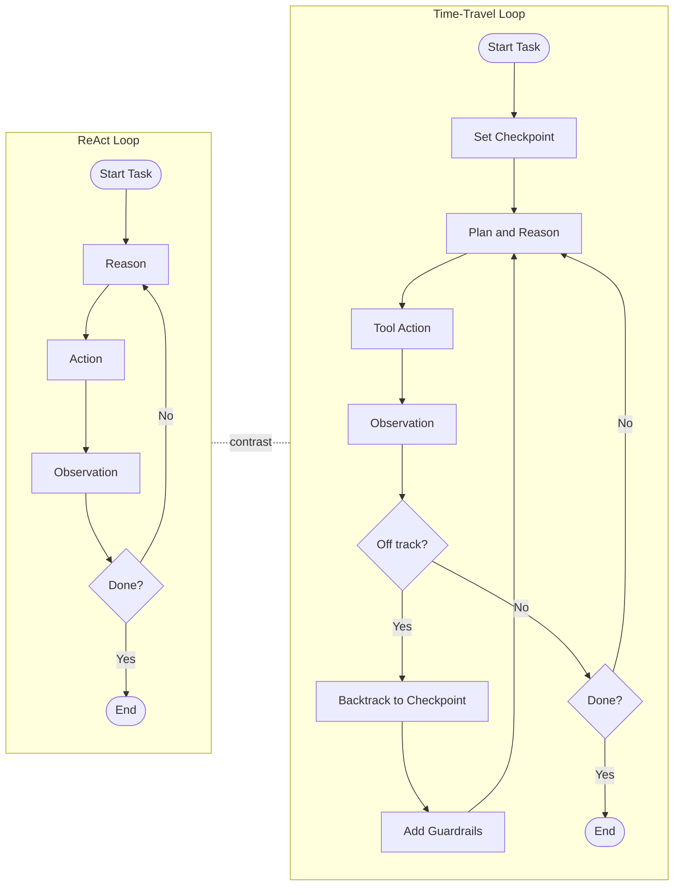
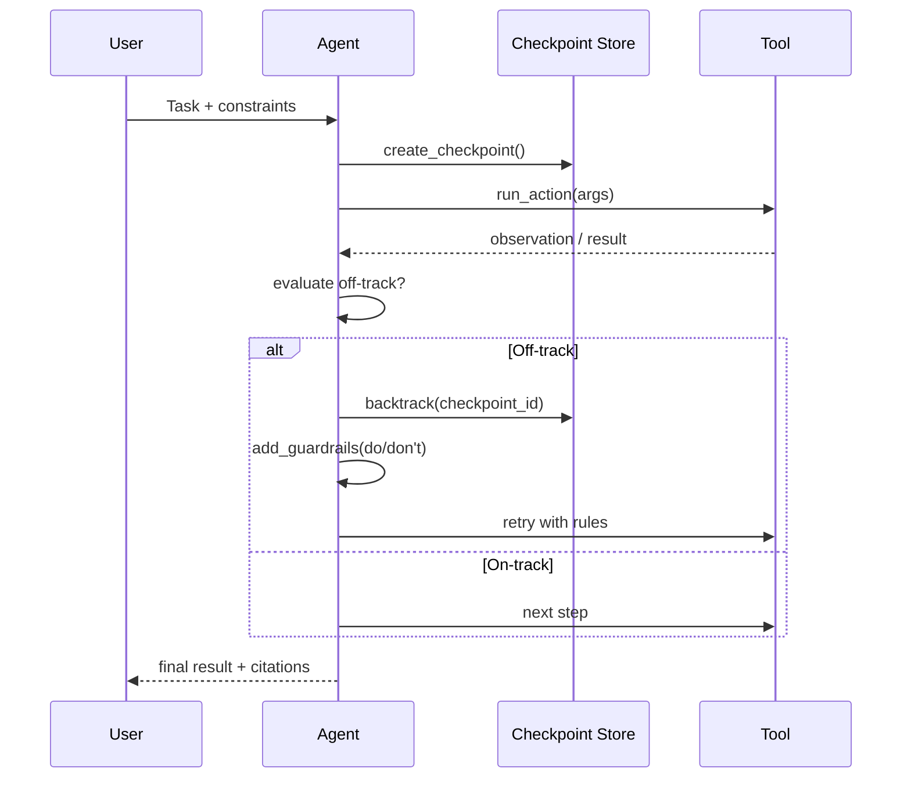

+++
title = "Agent Control via Time‑Travel Checkpoints"
date = "2025-11-12T00:00:00+08:00"
draft = false
tags = ["LLM", "Developer Tools", "Context Engineering", "Agent", "Gemini Cli"]
categories = ["AI Engineering"]
description = "How checkpoints, backtracking, and guardrails enable controllable, efficient agent loops."
copyright = "© 2025 Leslie Tech Notes. All rights reserved."
+++

## Table of Contents

- [What Is a Time-Travel Agent](#what-is-a-time-travel-agent)
- [Time-Travel vs. ReAct (web search example)](#time-travel-vs-react-web-search-example)
- [Why use time-travel checkpoints](#why-use-time-travel-checkpoints)
- [When to time-travel vs. append results](#when-to-time-travel-vs-append-results)
- [Challenges: side-effects and filesystem rollback](#challenges-side-effects-and-filesystem-rollback)
- [Conclusion and outlook](#conclusion-and-outlook)

## What Is a Time-Travel Agent

A time‑travel agent is a normal agent loop with one extra skill: it can set checkpoints before running tools, and jump back to them if things start to go wrong. When it jumps back, it also adds simple rules (like “prefer X” or “avoid Y”) so the next attempt is more focused.

This turns a blind, ever‑branching search into a process we can correct and steer.

Core pieces:
- Checkpoint: a small, replayable snapshot of the conversation/tool state.
- Backtrack message: “go back to checkpoint N and try again with these rules.”
- Guardrails that stick: do/don’t rules that stay until we remove them.

## Time-Travel vs. ReAct (web search example)

Compare two loops: ReAct (Reason → Action → Observation) and Time‑Travel (Checkpoint → Backtrack → Guardrail).

- Shape and control
  - ReAct: moves forward on one path and keeps branching without clear pruning. Noise and partial info make it sprawl.
  - Time‑Travel: jump back and add rules to prune mistakes. Search stays directed and easier to review.

- Context and state
  - ReAct: relies on new tool results to self‑correct by appending observations; context grows, so bad choices can carry forward.
  - Time‑Travel: uses explicit backtrack messages with guardrails; rewinds to a small checkpoint and keeps context lean with references instead of raw data.

Example: find Service X’s API rate‑limit policy.
- Task: “Find the policy and give a short summary with citations.” The site is big and spread out.
- ReAct: follows many links, pulls large pages, risks missing the canonical doc, and bloats context.
- Time‑Travel: set a checkpoint. If the crawl goes wide, backtrack with rules like “only docs.serviceX.com, depth ≤ 2, prefer /api|reference|rate|limits/, try HEAD to gauge size, fetch top‑k only, extract the policy section.” Then retry.
- Result: 3–5 small fetches, short excerpts with citations, controlled tokens, and a clear note on why scope was narrowed.

*Figure 1. Contrast between ReAct and Time‑Travel agent loops.*

## Why use time-travel checkpoints

Agents often make reasonable local choices that add up to bad global paths, especially with noisy tools or missing info. Time‑travel gives us a simple way to correct course:
- Fixability: cut off the wrong branch and try again.
- Bounded cost: don’t carry big payloads forward; restart with cheaper steps.
- Auditability: backtrack messages say what changed and why.
- Safety: policies enforce effect tiers and approvals.

Instead of letting the search grow without limits, we keep it narrow and guided. Bigger context windows only hide the problem while making each mistake cost more. Better state and control beat more raw context.

## When to time-travel vs. append results

Use time‑travel with guardrails when:
- Results are big or low‑signal and would bloat context (for example, >1,000 lines or tokens over budget).
- The observation suggests a better tactic (e.g., don’t read_all; use grep + range; refine the query).
- You repeated the same action a few times with poor outcomes.
- You want a clear “do/don’t” rule recorded earlier in the path.

Append results (lightweight and typed) when:
- Results are small, clear, and directly useful.
- Evidence can be passed as handles, ranges, previews, counts, or hashes instead of raw bulk.
- The observation supports the current plan without changing tactics.

Trade‑offs:
- Time‑travel + guardrails: prunes bad branches and keeps context small. Rewind does not undo external side effects.
- Append results: keeps a straight story and shows raw evidence, but can bloat context and anchor on bad paths if the payload is large.

Quick rules of thumb:
- Time‑travel if tokens are tight, lines > ~1,000, or there’s a clearly cheaper route.
- Append (by reference) if ≤ ~200 lines or small, high‑signal JSON.

## Challenges: side-effects and filesystem rollback

Backtracking meets the real world. Use simple effect tiers and clear undo surfaces.

Effect tiers and policy:
- read‑only: no external changes; safe to auto‑backtrack.
- soft‑write: reversible local changes (like temp files); backtrack allowed with cleanup.
- hard‑write: irreversible or non‑idempotent changes (DB writes, orders, emails); don’t auto‑backtrack; require approvals and compensations.

Tool contracts and visibility:
- Tools declare an `effect_level` and, if possible, a `compensate()` path. Prefer dry‑run/preview modes.
- Keep a clear audit trail (who/what/when and evidence) for reviews and compensations.

Filesystem rollback with LLM context:
- Snapshot or copy‑on‑write: take a snapshot before the tool runs; on backtrack, restore it so the world matches the context.
- Operation log + compensation: record file operations with hashes/ranges; auto‑undo soft‑writes; require approvals for hard‑writes.
- State by reference: pass file handles/ranges/hashes instead of raw blobs to keep snapshots small and replays deterministic.
- External systems: favor idempotent APIs, cancel hooks, or compensating actions; if none exist, gate with approvals and refuse unsafe backtracks.

*Figure 2. Backtrack with guardrails sequence.*

## Conclusion and outlook

Time‑travel agents help control tree‑search growth. With checkpoints and simple context habits (compact summaries, references instead of raw dumps, clear budgets/refusals, and well‑tuned tools), agents stay fixable, reviewable, and cost‑predictable.

As tools get more powerful, these patterns move from “nice to have” to “must have.” Next steps:
- Wider use of effect‑tiered tools with dry‑run and compensation.
- Standard snapshot/replay surfaces for reliable backtracking across filesystems and services.
- Stronger guardrail persistence and policies, with human‑in‑the‑loop approvals where needed.

The fix is not “more context.” The fix is better state and better controls, so we move from unbounded growth to guided search.

Thanks to [Kimi CLI](https://github.com/MoonshotAI/kimi-cli) for the inspiration.
