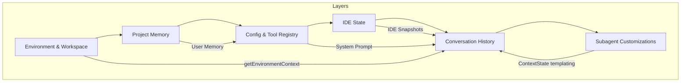
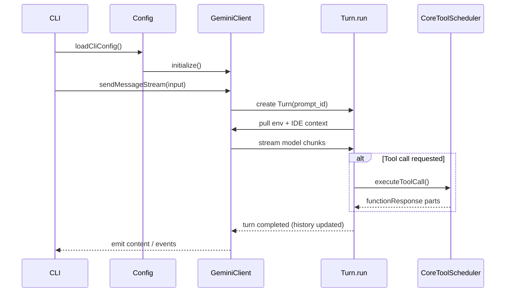
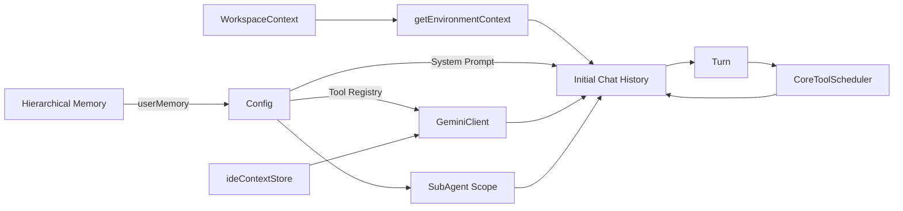

+++
title = "Dive into Context Engine: Lessons from the Gemini CLI"
date = "2025-10-18T16:38:23+08:00"
draft = false
tags = ["LLM", "Developer Tools", "Context Management"]
categories = ["AI Engineering"]
description = "Dissecting the Gemini CLI context engine to show how environment state, memory, IDE signals, and subagents stay in sync."
+++

## Table of Contents

- [Introduction](#introduction)
  - [Why Context Matters](#why-context-matters)
  - [Context Stack at a Glance](#context-stack-at-a-glance)
- [Gemini CLI Context Layers](#gemini-cli-context-layers)
  - [Layer 1: Environment & Workspace State](#layer-1-environment--workspace-state)
  - [Layer 2: Project Memory](#layer-2-project-memory)
  - [Layer 3: Tooling & System Persona](#layer-3-tooling--system-persona)
  - [Request/Response Timeline](#requestresponse-timeline)
  - [Layer 4: Active IDE Context](#layer-4-active-ide-context)
  - [Layer 5: Conversation Management](#layer-5-conversation-management)
  - [Layer 6: Subagents in the Same Ecosystem](#layer-6-subagents-in-the-same-ecosystem)
- [Context Refresh & Unload](#context-refresh--unload)
- [Design Takeaways](#design-takeaways)

## Introduction

> Written against repository revision `dc0e0b416592860bdc0846aed0386e1a9637a51e`.

### Why Context Matters

This guide is aimed at engineers and architects who build or operate LLM-powered developer tools. Gemini CLI is more than a chat wrapper. It assembles environment facts, project knowledge, user memory, IDE state, and agent-specific instructions into a cohesive **context bundle**—the structured payload that accompanies every user prompt. The following sections dissect that engine, layer by layer, and show how the pieces interact in code.

---

### Context Stack at a Glance

*Figure 1. Context artifacts flow from lower layers (environment) toward higher layers (conversation and subagents).*

---

## Gemini CLI Context Layers

The layers here are presented in ascending order. Each subsequent layer consumes artifacts produced by the previous one, so reading top to bottom mirrors the control flow inside Gemini CLI.

### Layer 1: Environment & Workspace State

Every chat session opens with a serialized snapshot of the machine and workspace:

- `getEnvironmentContext` collects OS, locale time, and a rendered folder tree for each workspace root, optionally streaming the full repo if `fullContext` is enabled (`packages/core/src/utils/environmentContext.ts:53`).
- Those roots are managed through `WorkspaceContext`, which validates directories, tracks listeners, and handles symlinks (`packages/core/src/utils/workspaceContext.ts:19`).

This layer ensures the model always sees “where” it is operating.

---

### Layer 2: Project Memory

Before the main agent spins up, Gemini CLI aggregates `GEMINI.md` memories from the user’s home directory, project tree, extensions, and included paths:

- The Gemini CLI wrapper bridges to the core library via `loadHierarchicalGeminiMemory`, delegating to server-side discovery (`packages/cli/src/config/config.ts:394`).
- Discovery walks real paths, stops at trust boundaries, and processes `@import` pragmas for hierarchical memories (`packages/core/src/utils/memoryDiscovery.ts:81`).

The resulting memory text enters the system prompt, grounding the model in persistent, curated knowledge.

---

### Layer 3: Tooling & System Persona

`Config` ties the environment and memory layers together. During initialization it:

- Instantiates `WorkspaceContext`, loads memory, and stores settings (`packages/core/src/config/config.ts:357`).
- Registers core tools, optional subagents, and message-bus integrations, producing a filtered `ToolRegistry`.
- Computes the system prompt via `getCoreSystemPrompt`, embedding memory, sandbox warnings, and tooling hints (`packages/core/src/core/prompts.ts:74`).

The system prompt is regenerated for every chat start, so configuration changes immediately affect model behavior.

---

### Request/Response Timeline

*Figure 2. Request/response flow between Gemini CLI, GeminiClient, the turn loop, and the tool scheduler.*

---

### Layer 4: Active IDE Context

When IDE mode is enabled, Gemini CLI streams editor state:

- `ideContextStore` normalizes open files, enforces limits, and broadcasts updates (`packages/core/src/ide/ideContext.ts:15`).
- `GeminiClient.sendMessageStream` injects either a full JSON snapshot or a delta, but only when no tool call is pending (to satisfy Gemini function-call ordering) (`packages/core/src/core/client.ts:491`).

IDE context is treated as additive user information, separate from static project memory.

---

### Layer 5: Conversation Management

`GeminiClient` orchestrates the conversation as an event loop:

1. `startChat` builds the initial history: environment parts, an acknowledgement, and any seed turns (`packages/core/src/core/client.ts:225`).
2. The configured system prompt plus tool list forms the `GeminiChat` instance (`packages/core/src/core/client.ts:233`).
3. `sendMessageStream` guards against loops, attempts auto compression, applies IDE context, and then hands off to `Turn.run`.
4. `Turn.run` parses streaming events, tracks citations, and queues tool calls (`packages/core/src/core/turn.ts:198`).
5. When a tool call appears, `CoreToolScheduler.schedule()` executes it and re-encodes the result into `functionResponse` parts that the same turn consumes (`packages/core/src/core/coreToolScheduler.ts:146`).
6. If the selected model supports “thinking mode,” `startChat` attaches a `thinkingConfig` so the API emits `<thought>` parts alongside normal text (`packages/core/src/core/client.ts:252`). Those thoughts can be scrubbed later if the history is reused.

This interplay keeps Gemini CLI in sync with tool output without losing track of the surrounding conversation.

---

### Layer 6: Subagents in the Same Ecosystem

Subagents behave like first-class tools but maintain their own mini-contexts:

- `SubagentToolWrapper` exposes an agent definition through the tool API while sharing the parent `Config` (`packages/core/src/agents/subagent-tool-wrapper.ts:68`).
- `SubAgentScope.createChatObject` pulls the same environment context and generates a bespoke system prompt by templating `ContextState` values (`packages/core/src/core/subagent.ts:610`).
- Subagents route tool calls back through `executeToolCall`, enforcing the same safety gates. Their final outputs return via `complete_task`, ready for the main agent to consume.

This design ensures subagents benefit from global memory and tools but can customize goals and instructions.

---

### Layer Cheat Sheet

| Layer | What it Captures | Key Components | Why it Matters |
|-------|------------------|----------------|----------------|
| Environment & Workspace | OS metadata, working directories, folder map | `WorkspaceContext`, `getEnvironmentContext` | Anchors every prompt in the correct filesystem view. |
| Project Memory | Long-lived project notes (`GEMINI.md`, extension context files) | `loadHierarchicalGeminiMemory`, `memoryDiscovery` | Transfers human-curated knowledge into system prompts. |
| Tooling & Persona | System instructions, allowed tools, policy hooks | `Config`, `PromptRegistry`, `ToolRegistry` | Enforces project conventions and safe tool usage. |
| IDE Context | Live editor focus, selections, open files | `ideContextStore`, `GeminiClient.sendMessageStream` | Injects developer intent without extra manual prompting. |
| Conversation Loop | Streaming turns, loop detection, tool scheduling | `GeminiClient`, `Turn.run`, `CoreToolScheduler` | Keeps interactive workflows coherent and recoverable. |
| Subagents | Task-specific delegates sharing global state | `SubagentToolWrapper`, `SubAgentScope` | Enables parallel investigations while honoring shared context. |

---

## Context Refresh & Unload

Lifelong sessions only stay useful if the engine can shrink or refresh its state on demand. Gemini CLI wires several safeguard paths directly into the runtime:

### Compression Pipeline (`packages/core/src/core/client.ts:656`)

1. **Budget gate.** `tryCompressChat` snapshots the “curated” history (user/model turns without invalid responses) and the last prompt’s token count from telemetry (`uiTelemetryService.getLastPromptTokenCount()`).
2. **Threshold check.** Unless `force` is set, the helper compares the token count with `contextPercentageThreshold` or the default `COMPRESSION_TOKEN_THRESHOLD`. If the conversation is still under budget, the method bails out early.
3. **History split.** `findCompressSplitPoint` chooses a boundary so the newest ~30 % of turns are kept verbatim. Everything before that boundary is marked for summarization.
4. **Model-assisted summary.** Gemini CLI calls `config.getContentGenerator().generateContent(...)` with the compressible turns and the compression system prompt returned by `getCompressionPrompt()` (`packages/core/src/core/prompts.ts:420`).
   - The prompt instructs the model to reason inside a private `<scratchpad>`, then output a `<state_snapshot>` XML element containing `overall_goal`, `key_knowledge`, `file_system_state`, `recent_actions`, and `current_plan`.
   - Because the XML schema is rigid, the summary becomes a drop-in replacement for the trimmed history without leaving ambiguity about what information must survive.
5. **Chat rebuild.** `startChat` is invoked with three seed messages: the default environment preamble, the model acknowledgement, and the generated summary, followed by the preserved tail of the original history. Because `startChat` always replays `getEnvironmentContext`, the resulting conversation carries the same base context but with a shorter transcript.
6. **Fallback tracking.** If the new token estimate still exceeds the original count, `hasFailedCompressionAttempt` is toggled to avoid repeated expansions until the user explicitly forces compression.

### Hard Reset (`packages/core/src/core/client.ts:198`)

Calling `resetChat()` delegates to `startChat()` without any extra seed messages. This flushes history, resets the `forceFullIdeContext` flag (ensuring the next request re-sends the full IDE snapshot), and reinstalls the latest system prompt and tool declarations. It’s effectively a “soft restart” of the agent without touching process state.

### Thought Hygiene (`packages/core/src/core/geminiChat.ts:432`)

Some Gemini models attach `thoughtSignature` metadata to parts when “thinking mode” is enabled. `GeminiChat.stripThoughtsFromHistory()` clones each stored turn and drops that field so the private reasoning chain never leaks into subsequent prompts or logs. `GeminiClient.stripThoughtsFromHistory()` exposes the same cleanup hook to higher layers when switching auth providers or replaying history.

### Workspace & IDE Refresh (`packages/core/src/ide/ideContext.ts:88`, `packages/core/src/utils/workspaceContext.ts:112`)

- `ideContextStore.clear()` wipes the cached editor context and notifies subscribers—`GeminiClient.sendMessageStream` will then ship the next full snapshot when the model is ready for a user message.
- `WorkspaceContext.setDirectories()` validates new roots, swaps the internal `Set`, and emits `onDirectoriesChanged` notifications that ultimately feed into the next `getEnvironmentContext()` run. Any listeners (diagnostics, watchers, etc.) can respond immediately.

Together, these routines keep the context engine deterministic, budget-aware, and resilient across long-running sessions.

---

## Design Takeaways

Even though the layers look discrete, they feed into each other through shared services:

*Figure 3. Shared services and stores propagate context updates across layers.*

* `WorkspaceContext` supplies directory roots; `getEnvironmentContext` reads them and produces the opening user parts.
* Collected memory text is stored on `Config` as `userMemory`, then embedded by `getCoreSystemPrompt` when the session starts.
* `GeminiClient` pulls both the environment parts and system prompt, attaches tool declarations from the shared `ToolRegistry`, and streams IDE deltas into the same history.
* Tool calls funnel through `CoreToolScheduler`, whose function responses are appended as user messages, enriching context for the next turn.
* Subagents reuse the parent `Config`, so their environment and memory mirror the main agent while their prompts are templated via `ContextState`; their outputs return to the shared history.
* Compression (`tryCompressChat`), resets, and IDE clears all operate via `Config`/`GeminiClient`, ensuring that when a layer changes the others see the new state.

1. **Layer context top-down.** Start from immutable environment facts, add project memory, then overlay dynamic user activity. Each layer should be independently refreshable.
2. **Centralize configuration.** A `Config` object that owns the workspace, tools, memory, and prompts becomes the single source of truth for the entire agent ecosystem.
3. **Treat subagents as peers.** Give them the same context bootstrap but allow instruction specialization. Wrapping them as tools lets the main agent orchestrate complex workflows.
4. **Plan for cleanup.** Compression, reset, and pruning functions are essential; without them, context quality degrades over time.

---

By studying Gemini CLI’s context engine, you can architect systems that remain coherent even as they juggle user memories, source-tree insight, IDE states, and multi-agent collaboration. The key is disciplined layering and relentless control over what the model sees at each turn.
